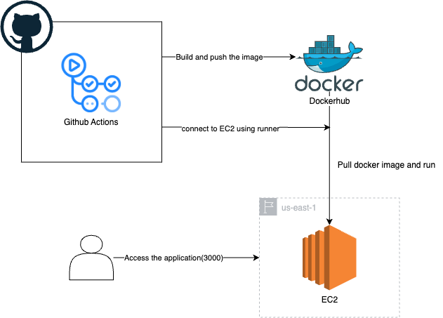

## Description: 

Its a basic web server which displays hello world on port 3000.

## Steps to setup the AWS Environment:

1. We need an EC2 instance and a Key pair to login via SSH.
2. To Setup EC2, we need to keep it inside a public subnet in order to make it publically available and add port 80,443 and 3000 for inbound traffic in security group.
3. Once our EC2 is up and running we will ssh into it and install the runner which will run the jobs written inside the actions workflow.

## Steps to setup the CICD pipeline:

1. Inside .github/workflows there are 2 files.
2. CI-image-push.yaml ---> inside CI file there are 4 steps, checkout code, login to dockerhub, build the docker image and push it to dockerhub.
3. CD-ec2-deploy.yaml ---> inside CD file there are 4 steps, checkout code, login to dockerhub, pull the image, run the container.
4. In  order to run the CD there is a workflow added which waits for CI to complete then starts the CD.
5. Also, there are environment variable defines inside the .yaml files, username and password which are used to authorize to dockerhub, these are stored in secret and variables inside the repository.

## Architecture Diagram:
